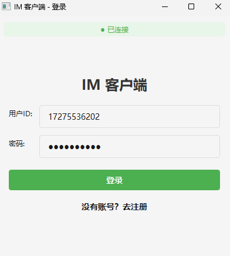
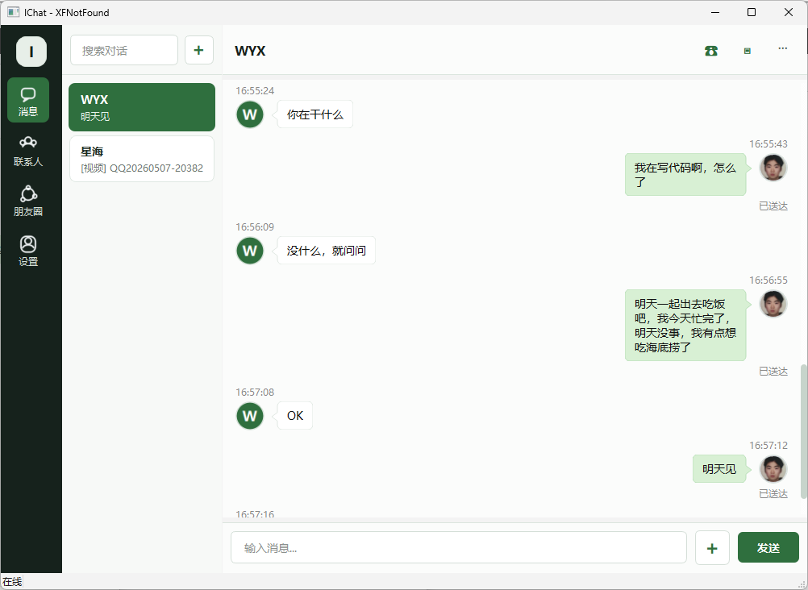
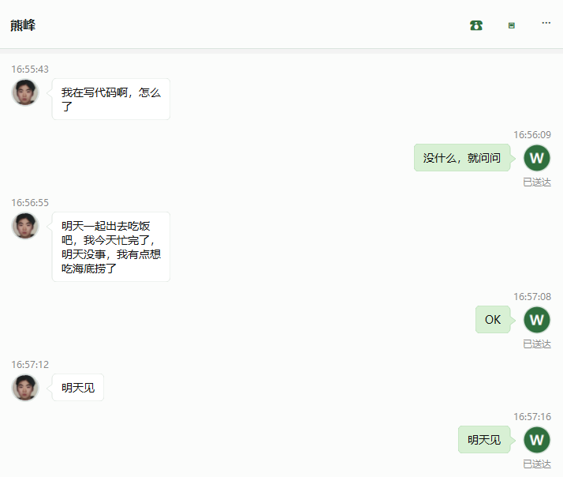
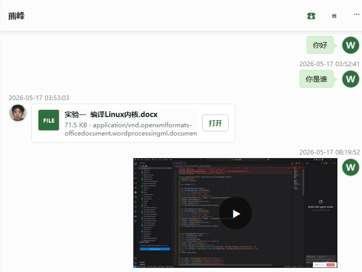
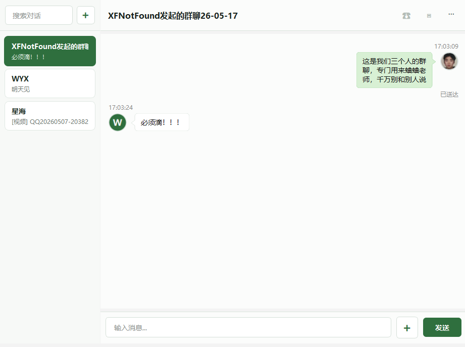
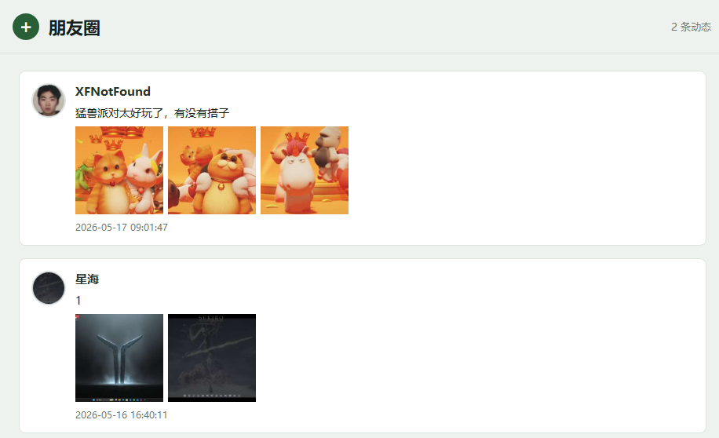
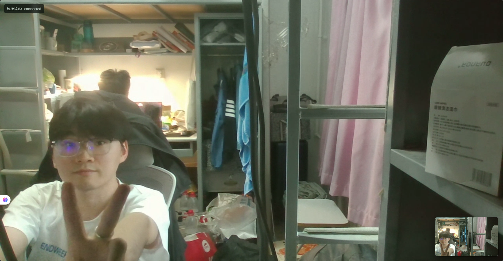

# IChat

IChat 是一个跨端即时通讯项目：服务端使用 C++17、Boost.Asio 和 MySQL，Windows 端使用 Qt6 Widgets，Android 端使用 Kotlin、Jetpack Compose、Room 和原生 TCP Socket。当前 Windows 端是功能最完整的参考实现，Android 端正在同步 Windows 端能力，并已经接入同一套服务端协议。

服务端使用自定义 TCP 协议承载登录、好友、聊天、群聊、文件、朋友圈和通话信令。聊天媒体统一走 `CHAT_MESSAGE`，通过 `content_type` 区分文本、图片、语音、视频和文件；大文件走分片上传下载，不直接塞进聊天 JSON。

## 当前状态

- Windows 客户端：已实现完整桌面 IM 主流程，包括账号、联系人、单聊/群聊、聊天历史、离线消息、媒体/文件传输、朋友圈图文和一对一音视频通话信令。
- Android 客户端：已同步登录/注册、token 冷启动恢复、底部四 Tab、联系人/群聊、好友请求、单聊/群聊文本、本地 Room 缓存、历史/离线消息、个人资料/头像、朋友圈图文、文件上传下载入口和后台通知。
- 服务端：已支持账号、好友、群聊、消息、离线消息、历史消息、资料头像、朋友圈、文件分片和 WebRTC 通话信令转发。
- Android 待补：视频消息播放、视频发送体验、音视频通话媒体管线和更完整的文件传输进度 UI。

## 项目功能

### 账号与个人资料

- 用户注册、登录、登出
- Windows 和 Android 保存登录凭证，支持 token 恢复登录态
- 修改昵称、性别、地区、个性签名
- 本地选择头像并压缩为 data URL 后同步到服务端
- 查看自己和好友的个人资料

### 好友与联系人

- 添加好友、处理好友请求
- 获取好友列表和群聊列表
- 修改好友备注
- 联系人资料页和快捷发起聊天
- Android 联系人按底部 Tab 与 Compose 页面组织，Room 本地缓存按账号隔离

### 即时消息

- 单聊和群聊文本消息
- 消息发送 ACK 回执
- 离线消息拉取与确认
- 历史消息分页查询
- 会话列表按最后消息时间排序
- 文本、图片、视频、文件等不同消息气泡或卡片展示

### 媒体与文件传输

- Windows 端支持图片、视频和普通文件发送
- 服务端支持文件分片上传和下载，单文件最大 200MB
- 下载链路支持发送背压：服务端按分片写入完成后再发送下一片，避免一次性堆积大量发送队列
- 图片消息可携带 `preview_data_url`，视频消息可携带 `poster_data_url`
- Android 文件默认下载到应用专属下载目录 `Android/data/com.ichat.android/files/Download/IChat`

### 群聊

- 创建群聊
- 获取群聊列表
- 群成员消息转发
- 群离线消息保存
- 群聊消息仍复用 `CHAT_MESSAGE`，通过 `chat_type=group` 和 `to_user_id=group_id` 区分

### 朋友圈

- 发布文字和图片动态
- 获取朋友圈时间流
- 查看指定用户动态
- 图片预览
- Android 端已接入图文发布、时间流、个人朋友圈入口和图片预览

### 音视频通话

- 一对一音视频通话邀请、接听、拒绝、取消、挂断和超时信令
- WebRTC offer / answer / ICE 信令转发
- Windows 客户端通过本地浏览器页面承载真实音视频通话
- 服务端只负责信令，不承载音视频媒体流
- Android 端通话媒体 UI/管线仍待实现

## 成果展示

当前截图主要来自 Windows 桌面端。

### 登录与注册



### 主界面与会话列表



### 单聊与媒体消息



### 文件/视频传输



### 群聊



### 朋友圈



### 视频通话



## 技术架构

```text
IChat
├── im_client/                   Qt6 Widgets Windows 客户端
│   ├── include/protocol.h        Windows 协议消息类型
│   ├── src/tcpclient.cpp         TCP 客户端、协议收发、文件上传下载、通话信令
│   ├── src/mainwindow*.cpp       消息、联系人、朋友圈、我的页面和通话 UI
│   └── web/call.html             浏览器 WebRTC 通话页面
│
├── im_android/                   Kotlin + Jetpack Compose Android 客户端
│   └── app/src/main/java/com/ichat/android/
│       ├── data/network/         6 字节包头协议、消息类型和 TCP 长连接
│       ├── data/repository/      Android 业务中枢，协调 Socket、Room、通知和文件
│       ├── data/db/              Room 会话、消息、好友和群组缓存
│       ├── data/storage/         登录态和附件目录
│       ├── notification/         后台聊天通知和点击路由
│       └── ui/                   Compose 登录、消息、联系人、朋友圈、我的页面
│
├── im_server/                    C++17 Boost.Asio 服务端
│   ├── src/session/              TCP 会话、异步读写、心跳和粘包处理
│   ├── src/protocol/             6 字节包头协议编解码
│   ├── src/dispatcher/           消息类型分发
│   ├── src/db/                   MySQL 连接池和业务数据访问
│   ├── src/server/               服务端主逻辑、聊天/文件/通话处理
│   ├── sql/                      数据库初始化和迁移脚本
│   └── docs/                     协议和数据库设计文档
│
└── docs/images/                  README 功能截图
```

## Android 同步说明

Android 端不是独立协议实现，而是复用 Windows 和服务端的同一套 TCP 协议：

- `MsgType.kt` 必须和 `im_client/include/protocol.h`、`im_server/src/protocol/message.h` 保持一致。
- `ProtocolCodec.kt` 固定使用 6 字节大端包头：2 字节消息类型 + 4 字节 body 长度。
- `IChatRepository` 是 Android 业务中枢，页面只通过 ViewModel 调用 Repository。
- Room 本地缓存的消息、会话、好友和群组都带 `ownerUserId`，避免账号切换串数据。
- `IChatSocketClient` 是进程级长连接，App 在后台但进程仍存活时可以继续收消息并触发系统通知。
- 头像和朋友圈图片会在 Android 本地压缩成 data URL，再按现有服务端字段上传。

## 核心协议

客户端和服务端之间使用自定义 TCP 协议。每条消息由固定 6 字节包头和变长 JSON 消息体组成：

```text
+------------------+------------------+------------------+
|  消息类型 2B      |   消息长度 4B     |   消息体 N bytes  |
+------------------+------------------+------------------+
```

- 消息类型使用 `uint16_t`
- 消息长度使用 `uint32_t`
- 多字节字段使用大端序
- 消息体通常为 UTF-8 JSON
- `CHAT_MESSAGE` 作为统一聊天消息，使用 `content_type` 区分 `text`、`image`、`video`、`file`、`voice`
- `IMAGE`、`FILE`、`VOICE` 只保留为旧客户端兼容类型

详细协议见 [im_server/docs/PROTOCOL.md](im_server/docs/PROTOCOL.md)。

## 数据存储

服务端使用 MySQL 保存用户、好友、群聊、消息、离线消息、朋友圈和文件元数据。媒体文件本体保存在服务端本地 `storage/files` 目录，聊天消息只保存文件元数据，例如 `file_id`、`file_name`、`file_size`、`mime_type` 和预览信息。

Android 端使用 Room 保存本地会话、消息、好友和群组缓存；登录态、token 和服务端地址保存在 `SharedPreferences`；附件下载保存在应用专属下载目录。

数据库设计见 [im_server/docs/DATABASE.md](im_server/docs/DATABASE.md)。

## 服务端构建与运行

### 环境要求

- C++17 编译器
- CMake 3.10+
- Boost.System / Boost.Thread / Boost.JSON
- MySQL client library
- MySQL Server

### 编译

```bash
cmake -S im_server -B im_server/build -DCMAKE_BUILD_TYPE=Release
cmake --build im_server/build --target im_server -j$(nproc)
```

### 初始化数据库

```bash
mysql -u root -p < im_server/sql/init_database.sql
```

服务端默认数据库连接参数位于 [im_server/src/main.cpp](im_server/src/main.cpp)。

### 启动

```bash
./im_server/build/im_server 8080
```

也可以指定线程数：

```bash
./im_server/build/im_server 8080 4
```

## Android 构建

Android 工程当前配置为 Android Gradle Plugin 9.1.1、Gradle Wrapper 9.3.1、Kotlin 2.3.21、Compose BOM 2026.05.00，需要 JDK 17 和对应 Android SDK。

```powershell
cd im_android
.\gradlew.bat :app:assembleDebug
```

## Windows 客户端

Windows 端使用 Qt6 Widgets。通话媒体默认走系统浏览器中的 WebRTC 页面，Qt WebEngine 不是必需依赖。更详细的 Windows 构建和 TURN 配置见 [im_client/README.md](im_client/README.md)。

## 音视频通话部署说明

`im_server` 只负责 WebRTC 信令，不承载音视频媒体流。公网通话建议部署 coturn：

- 开放 `TCP/UDP 3478`
- 开放 TURN relay UDP 端口范围
- 客户端配置 `ICHAT_TURN_HOST`、`ICHAT_TURN_USER`、`ICHAT_TURN_PASSWORD`

## 项目亮点

- 自定义 TCP 协议，处理粘包和半包
- Windows、Android、服务端共享同一套消息类型
- Boost.Asio 异步网络模型
- Session 级读写队列和心跳管理
- 文件分片上传/下载，支持大文件传输
- 下载发送链路具备背压控制，降低服务端内存峰值
- Android 使用 Repository + Room + StateFlow 保持账号隔离和后台消息通知
- 聊天、好友、群聊、朋友圈和音视频通话信令形成完整 IM 闭环

## 后续可扩展方向

- 补齐 Android 视频消息播放、视频发送体验和文件传输进度 UI
- 补齐 Android 一对一音视频通话媒体管线
- 文件存储接入对象存储或 CDN
- 群聊成员管理、群公告、群头像设置
- 朋友圈点赞、评论、可见范围
- 消息撤回、已读状态、多端同步
- 客户端文件传输任务队列和断点续传
- 服务端配置文件化，移除硬编码数据库参数
